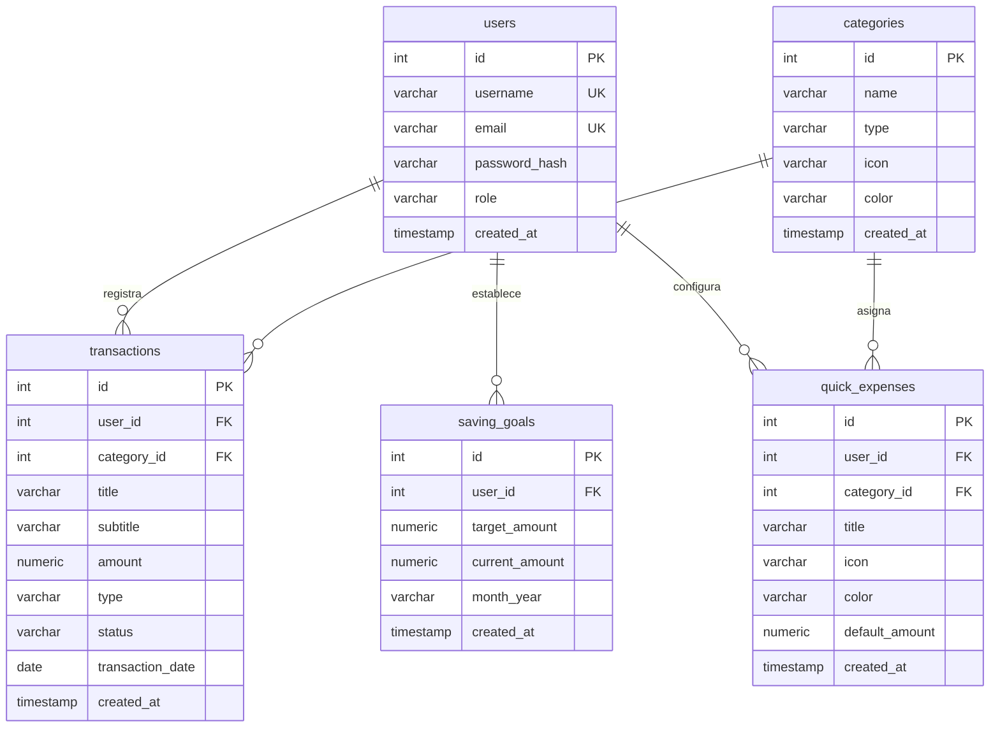

# 💼 K-Manager — Enterprise Financial & Expense Management System

<p align="center">
  <strong>Plataforma integral de gestión y control de flujos financieros, ingresos, egresos y analítica de tendencias en tiempo real.</strong>
</p>

<p align="center">
  
  
  
  
  
  
</p>

---

## 📌 Tabla de Contenidos

1. [Descripción General](#-descripción-general)
2. [Arquitectura del Sistema](#-arquitectura-del-sistema)
3. [Módulos y Capacidades](#-módulos-y-capacidades)
4. [Esquema de Base de Datos (PostgreSQL)](#-esquema-de-base-de-datos-postgresql)
5. [Endpoints de la API REST](#-endpoints-de-la-api-rest)
6. [Estructura del Repositorio](#-estructura-del-repositorio)
7. [Guía de Instalación y Puesta en Marcha](#-guía-de-instalación-y-puesta-en-marcha)
8. [Credenciales por Defecto (Auto-Seeding)](#-credenciales-por-defecto-auto-seeding)
9. [Seguridad y Mejores Prácticas](#-seguridad-y-mejores-prácticas)

---

## 📖 Descripción General

**K-Manager** es una solución web empresarial diseñada para la monitorización de flujos de capital, balances financieros, presupuestos y categorización de transacciones. Está construida bajo estándares de **Clean Architecture** (Arquitectura Limpia) y separación de responsabilidades, garantizando alta escalabilidad, seguridad basada en tokens y una experiencia de usuario reactiva mediante **Angular Signals**.

### ✨ Aspectos Clave
- **Autenticación Robusta**: Cifrado con Bcrypt y tokens JWT (Access Token + Refresh Token).
- **Persistencia Relacional**: Pool de conexiones PostgreSQL (`pg`) con auto-creación de tablas y datos semilla (*seeding*).
- **Reactividad con Signals**: Estado local ultra-rápido en el frontend sin sobrecarga de ciclos de detección tradicionales.
- **Gráficos SVG Dinámicos**: Curvas de tendencia de ingresos calculadas matemáticamente con soporte para diferentes periodos (6 meses / 1 año).
- **Sincronización CRUD en Tiempo Real**: Creación, lectura, actualización y eliminación de transacciones con reflejo instantáneo en los balances.
- **Feedback Visual Avanzado**: Notificaciones Toast enriquecidas con temporizador de progreso visual.

---

## 🏛 Arquitectura del Sistema

El proyecto opera bajo un modelo desacoplado cliente-servidor:

```text
┌─────────────────────────────────────────────────────────┐
│                 FRONTEND (Angular 19)                   │
│  - Standalone Components   - Signals & Computed State   │
│  - HTTP Interceptors (JWT) - Dynamic Math SVG Charts    │
└────────────────────────────┬────────────────────────────┘
                             │ HTTP / JSON (REST API)
                             ▼
┌─────────────────────────────────────────────────────────┐
│               BACKEND (Node.js & Express)               │
│  - Routes & Middlewares    - Controllers (HTTP Handlers)│
│  - Services (Domain Logic) - Repositories (Data Access) │
└────────────────────────────┬────────────────────────────┘
                             │ SQL Queries (pg Pool)
                             ▼
┌─────────────────────────────────────────────────────────┐
│                DATABASE (PostgreSQL 15+)                │
│  - users        - categories     - transactions         │
│  - saving_goals - quick_expenses                        │
└─────────────────────────────────────────────────────────┘
```

---

## 🚀 Módulos y Capacidades

### 1. 🔐 Autenticación & Control de Acceso (RBAC)
- Login con validación asíncrona de credenciales contra PostgreSQL.
- Verificación automática de expiración de sesión en background.
- Guardias de navegación (`auth.guard.ts`) que impiden acceso a rutas protegidas sin credenciales activas.
- Interceptor HTTP que inyecta automáticamente cabeceras `Authorization: Bearer <token>`.

### 2. 📊 Dashboard Principal
- **Métricas Clave**: Total de Ingresos, Total de Egresos, Ahorro Mensual acumulado y porcentaje de meta alcanzada.
- **Accesos Rápidos (Egresos Fijos)**: Configuración y disparo en un clic de pagos recurrentes (Luz, Agua, Hogar, Internet, Tarjetas).
- **Historial Global**: Visualización de las últimas transacciones con badge de estado (`Completado`, `Pendiente`, `Cancelado`).

### 3. 📈 Módulo de Ingresos
- **Resumen Financiero**: Balance consolidado de entradas con indicador de tendencia porcentual.
- **Curva de Tendencia SVG**: Gráfico interactivo con degradados esmeralda, resplandor neón (*glow effect*) y ajuste automático a 6 meses o 1 año.
- **Gestión Completa (CRUD)**:
  - ➕ **Nueva Operación**: Registro con vinculación automática a categorías de PostgreSQL.
  - ✏️ **Editar**: Precarga de datos en modal para actualización instantánea vía `PATCH`.
  - 🗑️ **Eliminar**: Modal de confirmación antes de la eliminación física vía `DELETE`.
- **Notificaciones Toast**: Alertas con estados `success`, `error` o `info` acompañadas de barra de progreso regresiva.

---

## 🗄 Esquema de Base de Datos (PostgreSQL)



---

## 📡 Endpoints de la API REST

Todos los endpoints (excepto `/api/auth/login` y `/health`) requieren la cabecera `Authorization: Bearer <token>`.

### 🔑 Autenticación (`/api/auth`)
| Método | Endpoint | Descripción | Body / Parámetros |
|---|---|---|---|
| `POST` | `/api/auth/login` | Autentica usuario y devuelve tokens JWT | `{ username, password }` |
| `GET` | `/api/auth/me` | Retorna los claims del usuario activo | — |

### 💳 Transacciones & Dashboard (`/api/dashboard`)
| Método | Endpoint | Descripción | Body / Parámetros |
|---|---|---|---|
| `GET` | `/api/dashboard/summary` | Balance general, totales, egresos fijos e historial | — |
| `GET` | `/api/dashboard/categories` | Catálogo de categorías (ingreso/egreso) | — |
| `GET` | `/api/dashboard/transactions` | Lista detallada de transacciones del usuario | — |
| `POST` | `/api/dashboard/transactions` | Crea una nueva transacción (ingreso o egreso) | `{ title, subtitle, amount, type, status, categoryId, transactionDate }` |
| `PATCH` | `/api/dashboard/transactions/:id` | Actualiza parcialmente una transacción existente | `{ title?, subtitle?, amount?, type?, status?, categoryId?, transactionDate? }` |
| `DELETE` | `/api/dashboard/transactions/:id` | Elimina permanentemente una transacción | Parámetro `id` en la URL |
| `GET` | `/api/dashboard/quick-expenses` | Obtiene egresos fijos del usuario | — |
| `POST` | `/api/dashboard/quick-expenses` | Crea un nuevo acceso rápido / egreso fijo | `{ title, categoryId, icon, color, defaultAmount }` |

---

## 📁 Estructura del Repositorio

```text
kmanager/
├── backend/
│   ├── src/
│   │   ├── config/          # Variables de entorno y pool PostgreSQL (database.ts)
│   │   ├── controllers/     # Controladores HTTP (auth, dashboard)
│   │   ├── middlewares/     # JWT Auth y validación de roles
│   │   ├── models/          # Interfaces TypeScript (user, transaction, category)
│   │   ├── repositories/    # Patrón Repositorio con consultas SQL (pg)
│   │   ├── routes/          # Enrutadores Express (auth.routes, dashboard.routes)
│   │   ├── services/        # Reglas de negocio y cálculos de balance
│   │   ├── utils/           # Firmado y verificación de JWT
│   │   ├── app.ts           # Configuración de Express, CORS y Middlewares
│   │   └── server.ts        # Bootstrap y escucha en puerto configurado
│   ├── .env                 # Variables de entorno locales
│   ├── package.json
│   └── tsconfig.json
│
├── frontend/
│   └── kmanager-frontend/
│       ├── public/
│       │   └── assets/      # Recursos gráficos corporativos (logos, favicons)
│       ├── src/
│       │   ├── app/
│       │   │   ├── admin/       # Panel para administradores
│       │   │   ├── auth/        # Login, Guards de ruta, Interceptor HTTP
│       │   │   ├── dashboard/   # Panel general financiero y egresos fijos
│       │   │   ├── ingresos/    # Módulo de ingresos, gráfico SVG y CRUD
│       │   │   ├── app.config.ts# Configuración global e inyección de dependencias
│       │   │   └── app.routes.ts# Definición de rutas y guardianes
│       │   ├── environments/    # Configuración de URLs de API por entorno
│       │   └── styles.css       # Estilos globales y reset
│       ├── angular.json
│       ├── package.json
│       └── tsconfig.json
│
├── README.md                # Documentación oficial del proyecto
└── pnpm-workspace.yaml      # Configuración de workspace monorepo
```

---

## ⚙️ Guía de Instalación y Puesta en Marcha

### Prerrequisitos
- **Node.js**: v18.0.0 o superior
- **pnpm**: v9.0.0 o superior (`npm install -g pnpm`)
- **PostgreSQL**: Instancia local o remota en ejecución

---

### 1. Configuración del Backend

1. Entrar en la carpeta del backend:
   ```bash
   cd backend
   ```
2. Instalar dependencias:
   ```bash
   pnpm install
   ```
3. Configurar el archivo `.env` en `backend/.env`:
   ```ini
   PORT=3000
   NODE_ENV=development

   # Conexión PostgreSQL
   DB_HOST=localhost
   DB_PORT=5432
   DB_NAME=kmanager
   DB_USER=postgres
   DB_PASSWORD=tu_password_postgres

   # Seguridad JWT
   JWT_SECRET=super_secret_jwt_access_key_kmanager_2026
   JWT_REFRESH_SECRET=super_secret_jwt_refresh_key_kmanager_2026
   ```
4. Iniciar el servidor en modo desarrollo:
   ```bash
   pnpm dev
   ```
   > 💡 **Nota**: Al iniciar, el backend creará automáticamente la base de datos `kmanager`, las tablas y los datos semilla si aún no existen.

---

### 2. Configuración del Frontend

1. Abrir otra terminal y navegar al frontend:
   ```bash
   cd frontend/kmanager-frontend
   ```
2. Instalar dependencias:
   ```bash
   pnpm install
   ```
3. Iniciar el servidor de desarrollo de Angular:
   ```bash
   pnpm start
   ```
4. Abrir en el navegador:
   ```text
   http://localhost:4200
   ```

---

## 👤 Credenciales por Defecto (Auto-Seeding)

La base de datos cuenta con dos cuentas iniciales listas para probar:

| Rol | Usuario | Contraseña | Permisos |
|---|---|---|---|
| **Administrador** | `admin` | `Admin123!` | Acceso total a Dashboard, Ingresos y Panel Administrativo |
| **Usuario Estándar** | `user` | `User123!` | Acceso a Dashboard e Ingresos personales |

*(Las contraseñas distinguen mayúsculas, minúsculas y caracteres especiales).*

---

## 🔒 Seguridad y Mejores Prácticas

1. **Protección contra Inyecciones SQL**: Todas las consultas hacia PostgreSQL utilizan queries parametrizadas con variables `$1, $2, ... $n`.
2. **Aislamiento Multi-Tenant**: Toda consulta de lectura, actualización o borrado incluye la cláusula estricta `WHERE user_id = $userId` extraída de forma segura del token JWT validado en el backend.
3. **Cifrado Unidireccional**: Las contraseñas se almacenan mediante el algoritmo `bcryptjs` con 10 rondas de *salt*.
4. **Validación de Tipos Estricta**: Control tipado de extremo a extremo mediante DTOs en TypeScript tanto en el cliente Angular como en el servidor Express.

---

<p align="center">
  Desarrollado para la gestión financiera eficiente.
</p>
